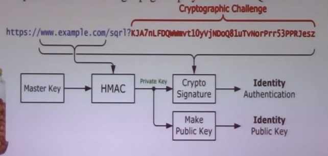
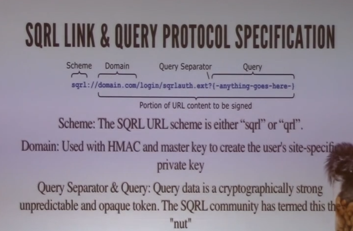

# sqrl
Golang implementation of Secure, Quick and Reliable Login.

Inspired by Daniel Holmlund's [presentation](https://www.youtube.com/watch?v=WHFaiUc7Qwk)

[SQRL discussions @Gibson](https://www.grc.com/groups/sqrl)
[Sqrl Auth Wiki](https://sqrlauth.net/Main_Page)